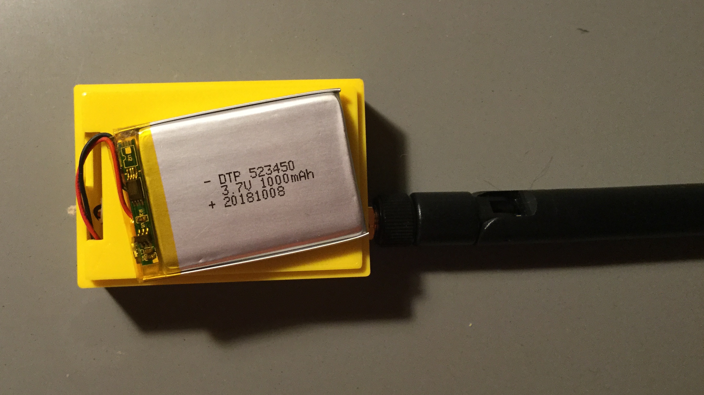
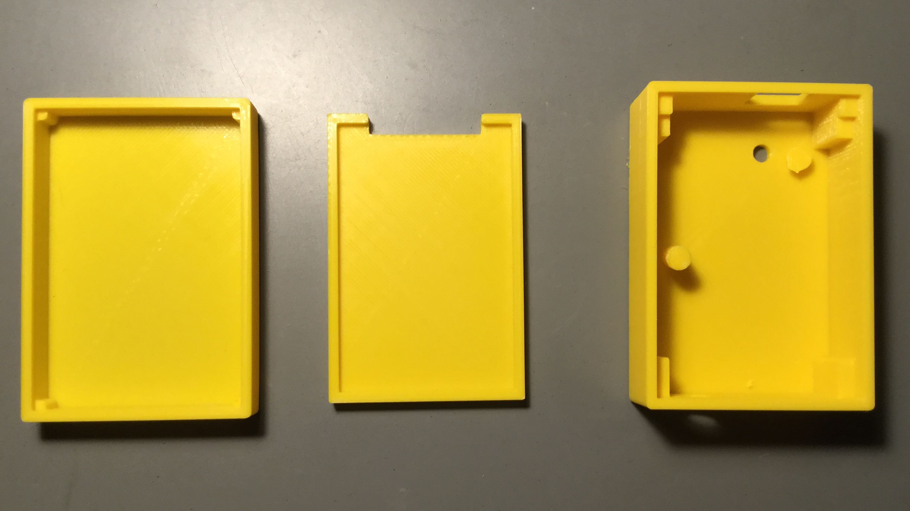

# Pycom LoPy4 Pytrack Case

Simple case for Pycom's Pytrack development board with a LoPy4 module and a LiPo battery. The case separates the LiPo battery from the modules and any sharp or pointy objects. The FreeCAD source contains a shorter part for the reset button on the LoPy4 module, but the tactile switch has such a small distance from the shielding on the module that I could not get it to work. I left out the part and use a bent paper clip to push the reset button through the hole.

# License

 Pycom LoPy4 Pytrack Case by <a xmlns:cc="http://creativecommons.org/ns#" href="www.dersuessmann.de" property="cc:attributionName" rel="cc:attributionURL">derSuessmann</a> is licensed under a <a rel="license" href="http://creativecommons.org/licenses/by-sa/4.0/">Creative Commons Attribution-ShareAlike 4.0 International License</a>.
